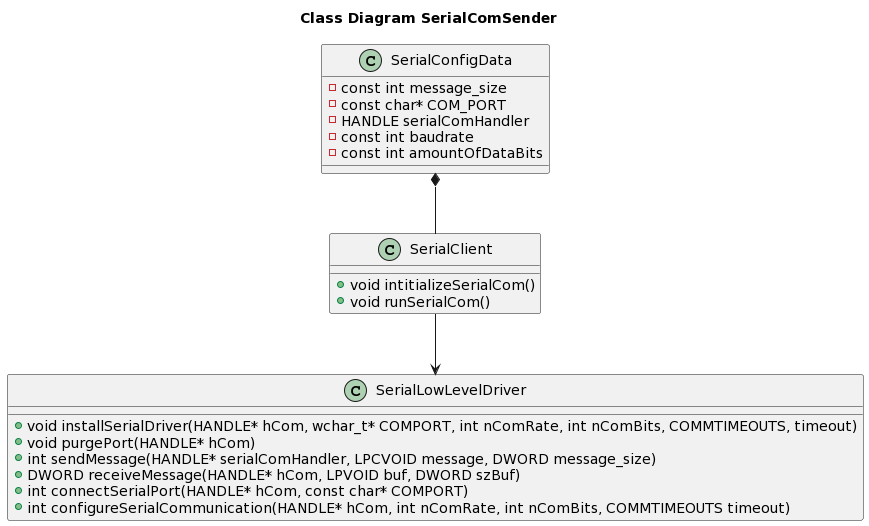

# Universal Asynchronous Receiver Transmitter PC
Serial communication based on the UART protocol for connecting different microcontrollers to an laptop. 

*Table of Contents*

- [Software & Hardware Requirements](#software--hardware-requirementssoftware-&-hardware-requirements)
- [Context](#context)
- [Building and running](#building-and-running)

# Software & Hardware Requirements

* C/C++ Compiler for Windows or Linux.
* Download the VS Code extension for making use of the standard C/C++ libraries.
* USB cable for establishing serial communication.
* Microcontroller which supports Arduino API.

*There is no need to install other extern programs. You don't have to install other libraries.*

# Context
* Programming language: C
* Development Environment: PC (Windows or Linux) and microcontroller.

# Building and running

* Before you are able to execute the program you need to compile it first. In order to accomplisch that you need to type in the following command:

*make uart_protocol_pc*

* If it's all good it says that the application is build succesfully. Now you are able to run the executable. In order to run the program you need to type in the following command:

*./uart_protocol_pc*

# Software Diagrams 
In this chapter we are going to look at several diagrams for having a better understanding how it is implemented.

## Class Diagram

